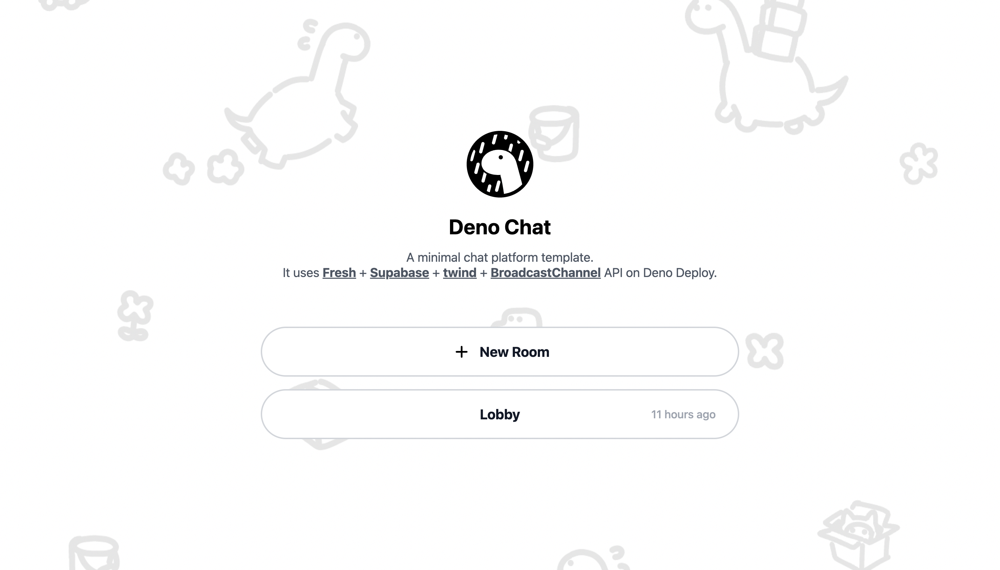

## `showcase_chat`

A minimal chat platform template. It uses [Fresh](https://fresh.deno.dev) +
[Supabase](https://supabase.io) + [twind](https://twind.dev) +
[BroadcastChannel API](https://developer.mozilla.org/en-US/docs/Web/API/Broadcast_Channel_API)
on Deno Deploy.

To get started, setup your `.env` with Supabase:

- `cp .env.example .env`

Create a Supabase project

- Go to app.supabase.io
- Click on "New Project".
- Enter project details and wait for the database to launch.
- Grab the URL and anon key and DB from and add them to the `.env` file.

and fire up the server:

```
deno task start
```
